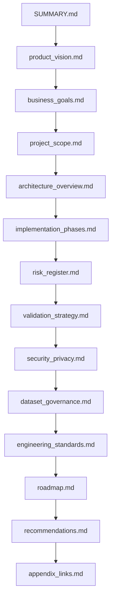

# 01 — Executive Implementation Plan

> **Document Type:** Navigation Index
> **Audience:** Managing Director · CTO · Engineering Manager
> **Version:** 1.0.0 | **Last Updated:** July 2026

---

## Purpose

This folder contains the executive-level implementation plan for the Elderly Assistant System.
Each file covers one topic. Read only what you need.

---

## Reading Order

| # | Document | Summary |
|:--|:---------|:--------|
| 1 | [SUMMARY.md](./SUMMARY.md) | One-page executive summary |
| 2 | [product_vision.md](./product_vision.md) | Mission, vision, and design principles |
| 3 | [business_goals.md](./business_goals.md) | Success metrics and acceptance criteria |
| 4 | [project_scope.md](./project_scope.md) | Resource requirements and compute needs |
| 5 | [architecture_overview.md](./architecture_overview.md) | High-level pipeline and deployment architecture |
| 6 | [implementation_phases.md](./implementation_phases.md) | 7-phase timeline and deliverables |
| 7 | [risk_register.md](./risk_register.md) | 23 risks with scoring and mitigation |
| 8 | [validation_strategy.md](./validation_strategy.md) | Testing pyramid: unit → integration → system → field |
| 9 | [security_privacy.md](./security_privacy.md) | Privacy-by-design and security controls |
| 10 | [dataset_governance.md](./dataset_governance.md) | Dataset lifecycle, versioning, and QA |
| 11 | [engineering_standards.md](./engineering_standards.md) | LLM Council review and engineering scorecard |
| 12 | [roadmap.md](./roadmap.md) | V1 → V2 → V3 version roadmap |
| 13 | [recommendations.md](./recommendations.md) | Immediate actions and quality gates |
| 14 | [appendix_links.md](./appendix_links.md) | Links to technical specification and appendix |

---

## Dependency Graph

---

## Related Folders

- [02_technical_architecture_specification/](../02_technical_architecture_specification/README.md) — Detailed engineering specification
- [03_engineering_appendix/](../03_engineering_appendix/README.md) — Code examples, templates, and reference material
