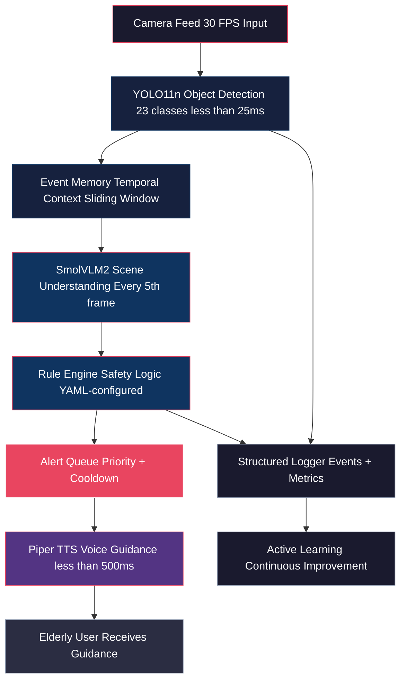
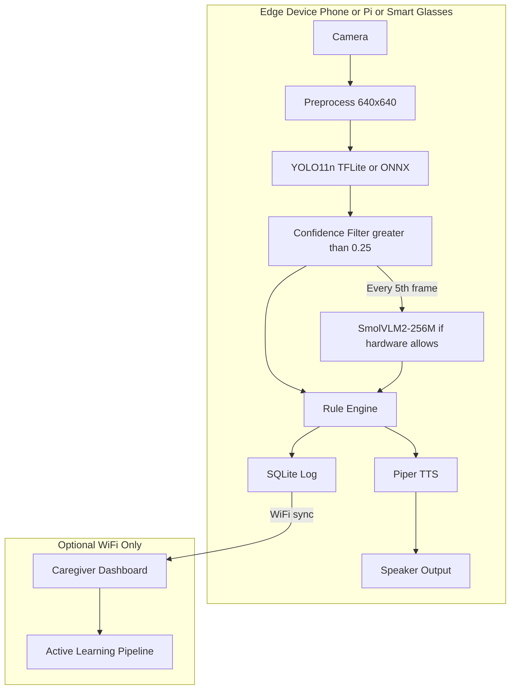

# System Architecture Overview

## Purpose

High-level pipeline architecture, component summary, deployment architecture, and performance budget for executive understanding.

## Dependencies

Reads:
- project_scope.md

Used By:
- implementation_phases.md
- risk_register.md

Related:
- ../02_technical_architecture_specification/system_architecture.md
- ../02_technical_architecture_specification/data_flow.md

---

## High-Level Pipeline

## Component Summary

| Component | Technology | Purpose | V1 Status |
|:----------|:-----------|:--------|:----------|
| Object Detection | YOLO11n (Ultralytics) | Real-time hazard detection | Core |
| Scene Analysis | SmolVLM2-256/500M | Context understanding | Optional/Core |
| Safety Logic | Rule Engine (YAML) | Decision making | Core |
| Voice Guidance | Piper TTS (neural) | Spoken alerts | Core |
| Event Memory | Python (sliding window) | Temporal context | Core |
| Structured Logging | JSON / SQLite | Audit trail | Core |
| Dataset Versioning | DVC + Git | Reproducibility | Core |

## Deployment Architecture

## Performance Budget (V1 Targets)

| Stage | Budget | Priority |
|:------|:-------|:---------|
| Camera capture | < 5 ms | Fixed |
| YOLO11n inference (CPU) | < 150 ms | Hard limit |
| YOLO11n inference (GPU/NPU) | < 25 ms | Target |
| Event Memory update | < 2 ms | Fixed |
| Rule Engine evaluation | < 5 ms | Fixed |
| SmolVLM2 inference | < 2,000 ms | Optional (5th frame) |
| Piper TTS synthesis | < 500 ms | Hard limit |
| **End-to-end (no VLM)** | **< 500 ms** | **Target** |
| **End-to-end (with VLM)** | **< 2,000 ms** | **Acceptable** |

> For detailed component specifications, see [../02_technical_architecture_specification/](../02_technical_architecture_specification/README.md)

---

Previous: [project_scope.md](./project_scope.md)

Next: [implementation_phases.md](./implementation_phases.md)

Related: [../02_technical_architecture_specification/system_architecture.md](../02_technical_architecture_specification/system_architecture.md)
