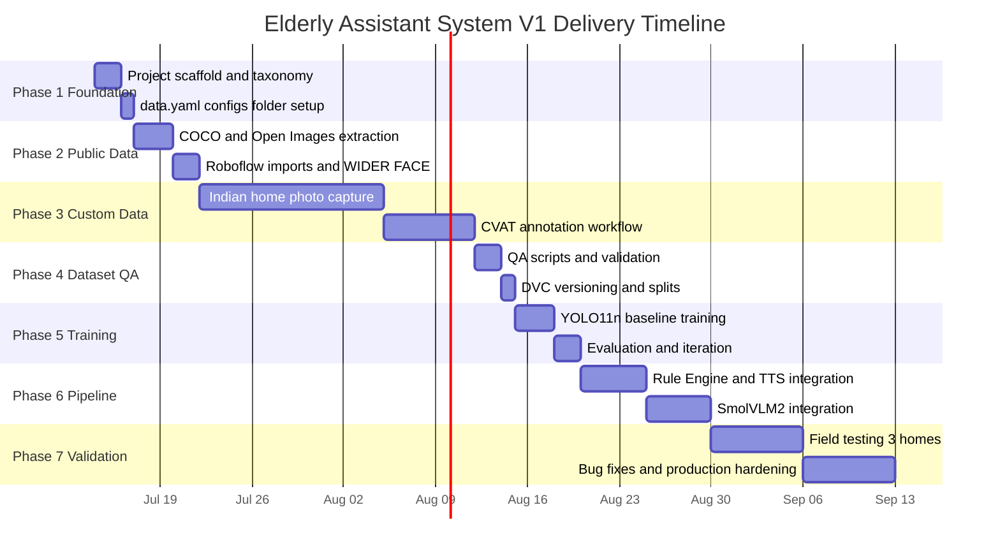

# Implementation Phases & Roadmap

## Purpose

Defines the 7-phase project timeline, deliverables per phase, and the 23-class object taxonomy.

## Dependencies

Reads:
- architecture_overview.md
- project_scope.md

Used By:
- risk_register.md
- recommendations.md

Related:
- roadmap.md

---

## Phase Timeline

## Phase Deliverables

| Phase | Name | Duration | Key Deliverables |
|:------|:-----|:---------|:----------------|
| **1** | Foundation & Taxonomy | 2–3 days | Project scaffold, 23-class taxonomy, `data.yaml`, folder structure |
| **2** | Public Dataset Acquisition | 3–5 days | COCO/Open Images/Roboflow subsets, format-converted, quality-filtered |
| **3** | Custom Dataset Collection | 2–4 weeks | 2,000+ Indian-home images, fully annotated via dual-annotator workflow |
| **4** | Dataset QA & Versioning | 2–3 days | QA reports, DVC-versioned dataset, 85/15 train-val splits |
| **5** | YOLO Training & Evaluation | 3–5 days | YOLO11n model (mAP50 ≥ 0.70), evaluation artifacts, confusion matrix |
| **6** | Pipeline Integration | 1–2 weeks | SmolVLM2 + Rule Engine + Piper TTS assembled, end-to-end tested |
| **7** | Production Validation | 1–2 weeks | Field-tested in 3 Indian homes, latency benchmarked, exportable model |

## Executed-Phase Reconciliation (audit finding D-1)

The table above is the original planning roadmap. The **executed** engineering
phases (git history, `CHANGELOG.md`) diverged from it deliberately as the work
revealed better sequencing — this addendum is the mapping of record
(pre-Phase-4 audit finding D-1, resolved in Phase 5 M0):

| Executed phase | What actually shipped | Roadmap phase(s) absorbed |
|:---|:---|:---|
| Phase 1 — Foundation | Scaffold, taxonomy, configs, runtime skeleton, docs 01–03 | 1 |
| Phase 2 — Public Dataset Platform | Downloaders, remap, dedup, merge+provenance, splits, QA suite, DVC pipeline (smoke build `dataset-v0.1.0-smoke`) | 2 + QA/versioning half of 4 |
| Phase 3 — Capture & Annotation Tooling | Consent/EXIF ingest, CVAT import + IAA gates, progress tracking, eval-set mechanics (tooling only — collection is a Phase-5 human track) | tooling half of 3 |
| Phase 4 — Missing-Annotation Mitigation | Completeness artifact + policy registry, preflight G1–G8, masked BCE loss, eval/benchmark frameworks, docs/06 | (not on the original roadmap — de-risks 5) |
| Phase 5 — Production Dataset Engineering | Auto-annotation + CVAT verification ledger, coverage/quality reports, release automation, full-mode build, custom-capture campaign (human track H-A completes roadmap Phase 3), Dataset v0.5→v1.0, full-scale A/B evidence | remainder of 3 + remainder of 4 + evaluation half of 5 |
| Phase 6 (next) — Model Training & Integration | Production training/tuning on Dataset v1.0, model export (`export_model.py`), runtime pipeline integration | training half of 5 + 6 |
| Phase 7 (unchanged) — Production Validation | Field testing, latency benchmarks | 7 |

Documents in docs/01–03 that reference "Phase 4 = Dataset QA" or "Phase 5 =
Training" describe the original roadmap; for execution status always consult
`CHANGELOG.md` and the per-phase engineering reports (docs/04 §Phase-3,
docs/06, docs/07).

## 23-Class Object Taxonomy

| Category | Classes | Source |
|:---------|:--------|:-------|
| **Safety-Critical** | `knife` · `stove` · `gas_cylinder` · `wire` · `wet_floor` · `medicine_strip` · `medicine_bottle` | Custom + COCO |
| **Navigation** | `person` · `face` · `door` · `walking_stick` · `support_handle` | COCO + Custom |
| **Furniture** | `chair` · `bed` · `cupboard` · `toilet` · `sink` | COCO + Open Images |
| **Daily Objects** | `water_bottle` · `laptop` · `monitor` · `charger` · `book` | COCO + Custom |
| **Documents** | `passport` | Custom mandatory |

> [!IMPORTANT]
> 8 of 23 classes require **mandatory custom Indian-home data collection** — these classes do not exist in adequate form in any public dataset (gas cylinders, medicine strips, wet floors, walking sticks, support handles, Indian stoves, passports, Indian cupboards).

---

Previous: [architecture_overview.md](./architecture_overview.md)

Next: [risk_register.md](./risk_register.md)

Related: [roadmap.md](./roadmap.md)
