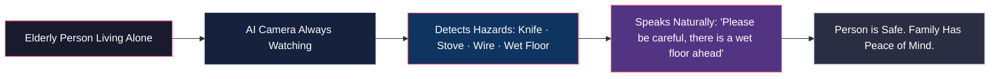

# Product Vision & Mission

## Purpose

Defines the mission statement, product vision, and core design principles for the Elderly Assistant System.

## Dependencies

Reads:
- SUMMARY.md

Used By:
- business_goals.md
- architecture_overview.md

Related:
- security_privacy.md

---

## Mission Statement

> *"To give every elderly person living in an Indian home a silent, always-on safety companion — one that watches, understands, and speaks — without ever invading their privacy."*

## Product Vision

## Core Design Principles

| Principle | Implementation |
|:----------|:--------------|
| **Privacy by Default** | Zero data leaves device; no facial recognition; no biometric storage |
| **Safety First** | False negatives (missed hazards) are worse than false positives |
| **Accessibility** | Clear spoken guidance; no screen interaction needed |
| **Indian Context** | Trained on Indian homes, objects, lighting, and layouts |
| **Graceful Degradation** | Works in reduced capacity even if subsystems fail |
| **Non-intrusive** | Alert cooldowns prevent alert fatigue |

---

Previous: [SUMMARY.md](./SUMMARY.md)

Next: [business_goals.md](./business_goals.md)

Related: [security_privacy.md](./security_privacy.md)
