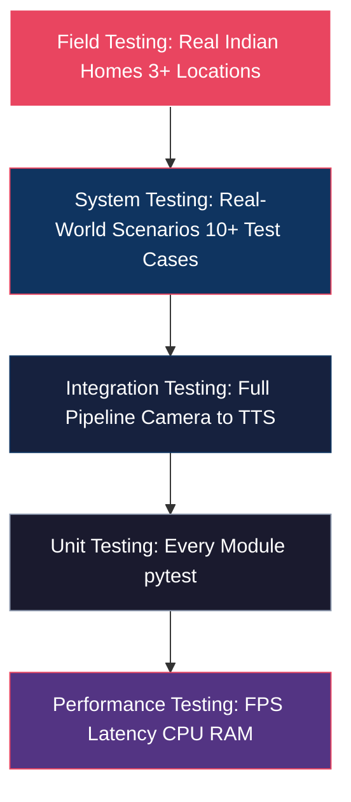

# Validation & Acceptance Strategy

## Purpose

Defines the testing pyramid: unit testing, integration testing, system testing, performance testing, and field testing.

## Dependencies

Reads:
- business_goals.md
- risk_register.md

Used By:
- recommendations.md
- engineering_standards.md

Related:
- ../02_technical_architecture_specification/error_handling.md
- ../03_engineering_appendix/testing_templates.md

---

## Testing Pyramid

## Unit Testing Coverage

| Module | Test Cases | Pass Criteria |
|:-------|:-----------|:-------------|
| `detector.py` | Model loads, inference runs, output format correct | 100% pass |
| `rule_engine.py` | Each of 6+ rules fires on correct conditions | 100% rule coverage |
| `event_memory.py` | Window correctly tracks temporal state | Object persistence verified |
| `tts_engine.py` | Audio output produced, no silent failures | Audio file valid |
| `config.py` | YAML loads correctly, validation works | Schema validates |
| `logger.py` | Events logged in correct JSON format | Schema compliant |
| QA scripts | All 8 QA checks detect injected errors | 100% detection |

## Integration Testing: Full Pipeline Scenarios

| Test | Input | Expected Output |
|:-----|:------|:----------------|
| Knife near person | Video of knife on kitchen counter | HIGH alert, spoken warning within 2s |
| Wet floor detected | Shiny bathroom floor video | HIGH alert, "floor appears wet" |
| Stove unattended | Stove visible, no person for 30s | CRITICAL alert triggered |
| Gas cylinder alone | LPG cylinder without stove | INFO reminder about regulator |
| Medicine visible | Medicine strip on table | INFO reminder |
| Empty room | Empty living room | No alert — no false positive |
| Multiple people | Two people in frame | No spurious alert |

## System Testing Scenarios

| Scenario | Room | Lighting | Expected Behavior |
|:---------|:-----|:---------|:-----------------|
| Knife left on counter | Kitchen | Bright | HIGH alert: "knife nearby" |
| Wet bathroom floor | Bathroom | Normal | HIGH alert: "floor appears wet" |
| Gas stove unattended | Kitchen | Evening | CRITICAL: "stove without supervision" |
| Medicines scattered | Bedroom | Dim | INFO: "medicine is visible" |
| Extension cord on floor | Living room | Night/lamp | HIGH: "tripping hazard wires" |
| LPG cylinder without stove | Kitchen | Bright | INFO: regulator check |
| Walking stick near person | Hallway | Any | No alert — assistive device, not hazard |
| False positive: shiny floor | Living room | Bright | No wet floor alert |
| False positive: plastic bottle as medicine | Kitchen | Any | No spurious medicine alert |
| Empty room | Any | Any | No alert for 60+ seconds |

## Performance Testing Targets

| Metric | Tool | Target | Critical Threshold |
|:-------|:-----|:-------|:------------------|
| Detection FPS (CPU) | `benchmark_latency.py` | ≥ 15 FPS | < 10 FPS = FAIL |
| Detection FPS (GPU) | `benchmark_latency.py` | ≥ 30 FPS | < 15 FPS = FAIL |
| End-to-end latency | Timestamp profiler | < 2,000 ms | > 3,000 ms = FAIL |
| RAM usage (peak) | `memory_profiler` | < 2 GB | > 3 GB = FAIL |
| CPU usage (steady state) | `psutil` | < 60% | > 80% = FAIL |
| Battery drain rate | Device monitor | < 20%/hr | > 35%/hr = FAIL |
| Thermal throttle onset | Device temp monitor | > 30 min before throttle | < 10 min = FAIL |

## Field Testing Protocol

| Location | Variation Tested | Pass Criteria |
|:---------|:----------------|:-------------|
| Indian home #1 (kitchen focus) | Bright daylight · Indian stove/cylinder | All kitchen hazards detected |
| Indian home #2 (bedroom focus) | Dim lighting · Medicines · Walking stick | Medicines and walking stick detected |
| Indian home #3 (mixed) | Different camera height · Clutter | No false positives; hazards detected |
| Hallway/bathroom | Wet floor · Night lighting | Wet floor detected under dim conditions |

---

Previous: [risk_register.md](./risk_register.md)

Next: [security_privacy.md](./security_privacy.md)

Related: [../02_technical_architecture_specification/error_handling.md](../02_technical_architecture_specification/error_handling.md)
