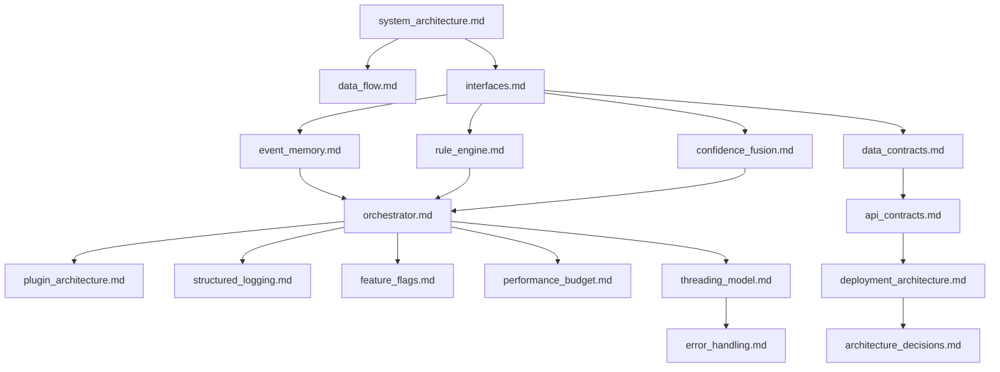

# 02 — Technical Architecture Specification

> **Document Type:** Navigation Index
> **Audience:** Software Engineers · ML Engineers · Backend Engineers
> **Version:** 1.0.0 | **Last Updated:** July 2026

---

## Purpose

This folder contains the detailed technical specification for the Elderly Assistant System.
Each file covers one component or architectural concern. Read only what you need.

---

## Reading Order

| # | Document | Summary |
|:--|:---------|:--------|
| 1 | [system_architecture.md](./system_architecture.md) | Project structure, runtime diagrams, training pipeline |
| 2 | [data_flow.md](./data_flow.md) | Training pipeline architecture |
| 3 | [interfaces.md](./interfaces.md) | Core dataclasses, enums, and module interfaces |
| 4 | [event_memory.md](./event_memory.md) | Sliding-window temporal memory component |
| 5 | [rule_engine.md](./rule_engine.md) | YAML-driven safety rule evaluation |
| 6 | [confidence_fusion.md](./confidence_fusion.md) | YOLO + VLM score fusion formula |
| 7 | [orchestrator.md](./orchestrator.md) | Main pipeline coordinator and frame loop |
| 8 | [plugin_architecture.md](./plugin_architecture.md) | Plugin system and registry |
| 9 | [structured_logging.md](./structured_logging.md) | Event logger and active learning |
| 10 | [feature_flags.md](./feature_flags.md) | Runtime feature toggles |
| 11 | [performance_budget.md](./performance_budget.md) | Latency, memory, and profiling budgets |
| 12 | [threading_model.md](./threading_model.md) | Multi-thread architecture and synchronization |
| 13 | [error_handling.md](./error_handling.md) | Graceful degradation levels and error table |
| 14 | [data_contracts.md](./data_contracts.md) | Component specifications: YOLO, VLM, TTS, Alert Queue |
| 15 | [api_contracts.md](./api_contracts.md) | Configuration architecture and schema |
| 16 | [deployment_architecture.md](./deployment_architecture.md) | Engineering standards, code style, and versioning |
| 17 | [architecture_decisions.md](./architecture_decisions.md) | Assumptions, constraints, trade-offs, limitations, operational readiness |

---

## Dependency Graph

---

## Related Folders

- [01_executive_implementation_plan/](../01_executive_implementation_plan/README.md) — Executive summary and business context
- [03_engineering_appendix/](../03_engineering_appendix/README.md) — Code examples, templates, and reference material
