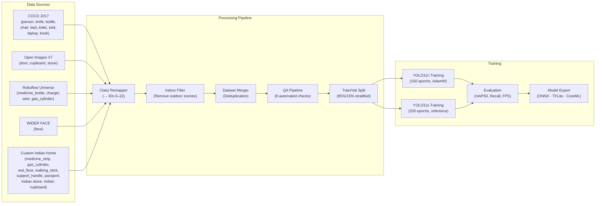

# Data Flow — Training Pipeline

## Purpose

Training pipeline architecture showing data sources, processing stages, and model output.

## Dependencies

Reads:
- system_architecture.md

Used By:
- interfaces.md

Related:
- ../03_engineering_appendix/dataset_templates.md

---

## Training Pipeline Architecture

## Data Processing Stages

| Stage | Script | Input | Output |
|:------|:-------|:------|:-------|
| COCO extraction | `01_download_coco_subset.py` | COCO 2017 API | `data/raw/coco_filtered/` |
| Open Images | `02_download_openimages_subset.py` | OI V7 API | `data/raw/openimages_filtered/` |
| Roboflow | `03_download_roboflow_datasets.py` | Roboflow Universe | `data/raw/roboflow_imports/` |
| WIDER FACE | `04_download_wider_face.py` | WIDER FACE | `data/raw/wider_face/` |
| Class remap | `05_remap_classes.py` | Raw labels | Remapped labels (IDs 0–22) |
| Indoor filter | `06_filter_indoor_images.py` | All images | Indoor-only subset |
| Merge | `07_merge_datasets.py` | All raw sources | `data/processed/` |
| QA | `run_full_qa.py` | `data/processed/` | `data/qa_reports/` |
| Split | `08_split_train_val.py` | Processed data | Train/Val splits |

---

Previous: [system_architecture.md](./system_architecture.md)

Next: [interfaces.md](./interfaces.md)

Related: [../03_engineering_appendix/dataset_templates.md](../03_engineering_appendix/dataset_templates.md)
