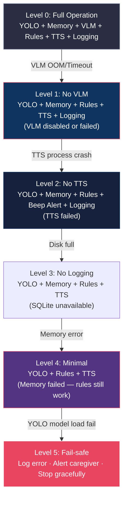

# Error Handling & Graceful Degradation

## Purpose

Defines 5 degradation levels and error recovery actions for every component.

## Dependencies

Reads:
- threading_model.md
- performance_budget.md

Used By:
- architecture_decisions.md

Related:
- ../01_executive_implementation_plan/risk_register.md

---

## Degradation Levels

## Error Handling Table

| Component | Failure Mode | Recovery Action | Degrades To |
|:----------|:-------------|:----------------|:------------|
| YOLO detector | Model file not found | Log CRITICAL, exit | Level 5 |
| YOLO inference | Runtime exception | Log ERROR, skip frame | No impact |
| Event Memory | Out of memory | Shrink window size by 50% | Level 4 |
| SmolVLM2 | OOM or timeout | Disable VLM, use flag | Level 1 |
| Rule Engine | YAML parse error | Use previous rules | No impact |
| Alert Queue | Overflow | Drop oldest INFO alerts | No impact |
| Piper TTS | Process crash | Restart process, use beep fallback | Level 2 |
| SQLite logger | Disk full | Disable logging, continue | Level 3 |
| Camera | Feed lost | Watchdog restart, TTS notify | Paused |

## Watchdog Thread

Optional 5th thread monitors health of all components every 5 seconds. Restarts crashed threads automatically (max 3 retries before escalation).

---

Previous: [threading_model.md](./threading_model.md)

Next: [data_contracts.md](./data_contracts.md)

Related: [../01_executive_implementation_plan/risk_register.md](../01_executive_implementation_plan/risk_register.md)
