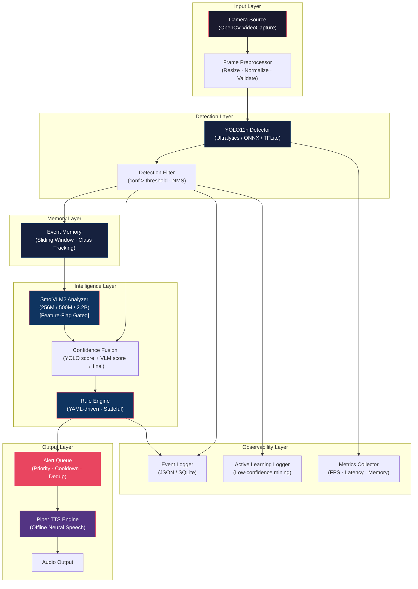

# System Architecture

## Purpose

Project folder structure and runtime component architecture diagram.

## Dependencies

Reads: None (entry point for technical docs)

Used By:
- data_flow.md
- interfaces.md
- all component documents

Related:
- ../01_executive_implementation_plan/architecture_overview.md

---

## Project Structure

```
YOLO_V1/
├── configs/                          # All configuration files
│   ├── data.yaml                     # YOLO dataset configuration
│   ├── feature_flags.yaml            # Runtime feature toggles
│   ├── training/
│   │   ├── yolo11n_config.yaml       # Nano model hyperparameters
│   │   └── yolo11s_config.yaml       # Small model hyperparameters
│   └── deployment/
│       ├── onnx_config.yaml          # ONNX export settings
│       └── tflite_config.yaml        # TFLite quantization settings
│
├── data/                             # All dataset files (DVC tracked)
│   ├── raw/
│   │   ├── coco_filtered/
│   │   ├── openimages_filtered/
│   │   ├── roboflow_imports/
│   │   ├── wider_face/
│   │   └── custom_captures/
│   ├── processed/
│   │   ├── images/
│   │   │   ├── train/
│   │   │   └── val/
│   │   └── labels/
│   │       ├── train/
│   │       └── val/
│   └── qa_reports/
│
├── scripts/
│   ├── dataset/                      # Data acquisition and processing
│   ├── qa/                           # Quality assurance checks
│   ├── training/                     # Model training and export
│   ├── inference/                    # Inference and benchmarking
│   └── utils/                        # Conversion and visualization
│
├── src/
│   ├── pipeline/                     # Core pipeline components
│   │   ├── detector.py
│   │   ├── event_memory.py
│   │   ├── scene_analyzer.py
│   │   ├── rule_engine.py
│   │   ├── alert_queue.py
│   │   ├── tts_engine.py
│   │   ├── orchestrator.py
│   │   └── confidence_fusion.py
│   ├── config/                       # Config loading and validation
│   ├── logging/                      # Event and metrics logging
│   └── plugins/                      # Plugin system
│
├── models/                           # Trained model weights and exports
├── tests/                            # Unit, integration, and performance tests
├── docs/                             # Documentation (you are here)
├── dvc.yaml                          # DVC pipeline definition
├── requirements.txt                  # Python dependencies
└── README.md
```

## Runtime Component Architecture



---

Previous: None (start here)

Next: [data_flow.md](./data_flow.md)

Related: [interfaces.md](./interfaces.md)
