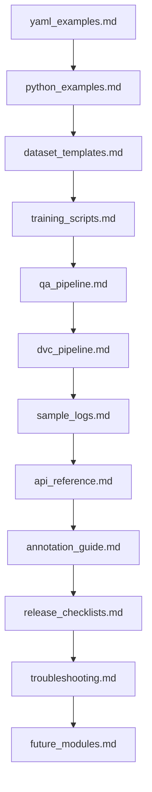

# 03 — Engineering Appendix

> **Document Type:** Navigation Index
> **Audience:** Engineers · DevOps · MLOps · QA
> **Version:** 1.0.0 | **Last Updated:** July 2026

---

## Purpose

This folder contains all code examples, configuration templates, script references, and operational checklists. Each file is self-contained and can be read independently.

---

## Reading Order

| # | Document | Summary |
|:--|:---------|:--------|
| 1 | [yaml_examples.md](./yaml_examples.md) | All YAML configuration templates |
| 2 | [python_examples.md](./python_examples.md) | Core Python implementation snippets |
| 3 | [dataset_templates.md](./dataset_templates.md) | Dataset pipeline scripts and class remapping |
| 4 | [training_scripts.md](./training_scripts.md) | YOLO training, evaluation, and export scripts |
| 5 | [qa_pipeline.md](./qa_pipeline.md) | QA orchestrator and individual check templates |
| 6 | [dvc_pipeline.md](./dvc_pipeline.md) | DVC pipeline definition |
| 7 | [sample_logs.md](./sample_logs.md) | Example JSON logs for all event types |
| 8 | [api_reference.md](./api_reference.md) | Pipeline module API table and VLM contract |
| 9 | [annotation_guide.md](./annotation_guide.md) | Annotation guidelines and class definitions |
| 10 | [release_checklists.md](./release_checklists.md) | Pre-release, deployment, and dataset checklists |
| 11 | [troubleshooting.md](./troubleshooting.md) | Common issues, log analysis, disaster recovery |
| 12 | [future_modules.md](./future_modules.md) | V2 and V3 planned module reference |

---

## Dependency Graph

---

## Related Folders

- [01_executive_implementation_plan/](../01_executive_implementation_plan/README.md) — Executive summary and business context
- [02_technical_architecture_specification/](../02_technical_architecture_specification/README.md) — Detailed engineering specification
